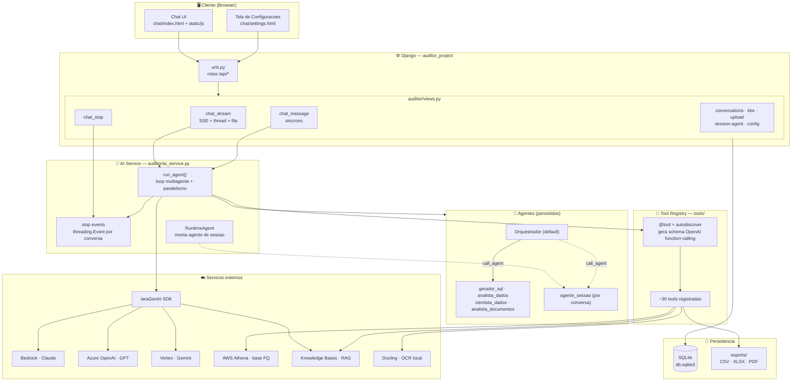
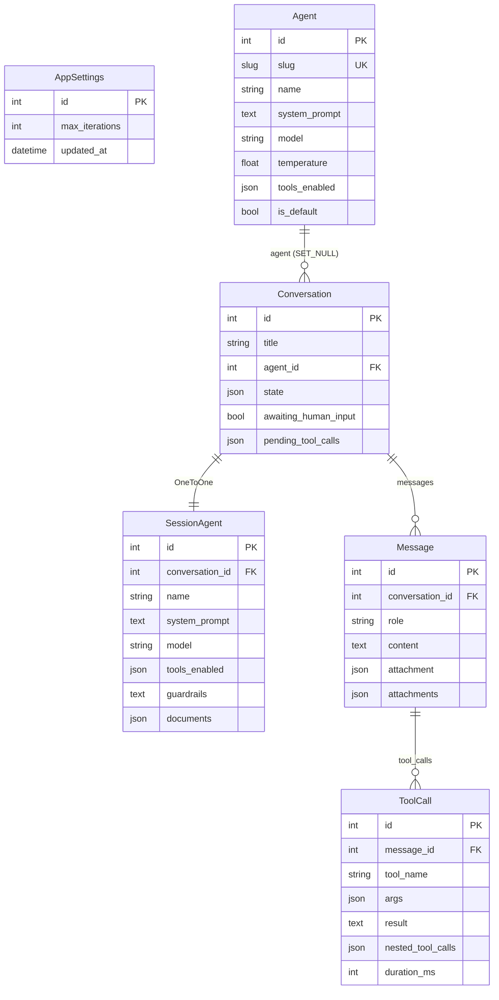
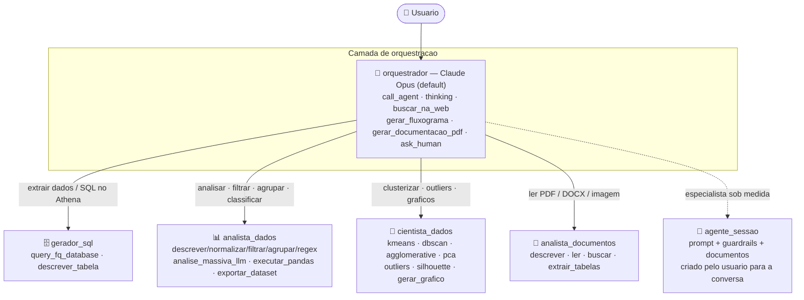
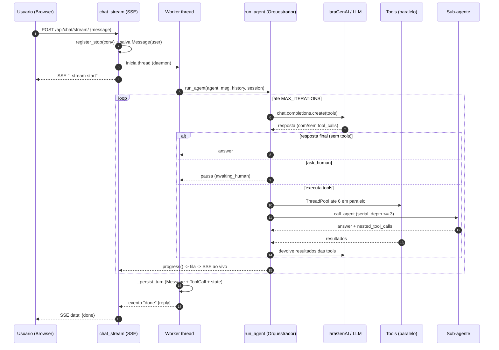

# 🏛️ Arquitetura do Sistema — Multi-Agentes de Auditoria

Sistema **Django** de auditoria interna assistida por IA, baseado num **orquestrador
multiagente** que delega para sub-agentes especialistas. Cada agente executa um loop
de _function-calling_ sobre um catálogo de ~30 _tools_, com execução paralela,
_streaming_ ao vivo (SSE), _human-in-the-loop_ e RAG sobre bases de conhecimento.

> Fonte da verdade da configuração dos agentes: banco `db.sqlite3` (tabela `auditor_agent`).
> Os prompts em `prompts/*.md` são recarregados nas migrations.

---

## 1. Stack tecnológico

| Camada | Tecnologia |
|---|---|
| Backend | Django 6.0 (`auditor_project`) |
| App principal | `auditor` (models, views, ai_service) |
| Persistência | SQLite (`db.sqlite3`) |
| LLM Gateway | **IaraGenAI SDK** (`iaragenai`) — multi-provider |
| Providers | Bedrock (Claude), Azure OpenAI (GPT), Vertex (Gemini) |
| Dados corporativos | AWS **Athena** (base FQ de reclamações) via boto3 |
| RAG | Knowledge Bases IARA (`similarity_search`) |
| OCR de documentos | **Docling** (modelos locais em `arquivos_suporte/docling/`) |
| Data/ML | pandas, scikit-learn (KMeans, DBSCAN, PCA, IsolationForest…) |
| Streaming | Server-Sent Events (SSE) + threads + `queue.Queue` |
| Frontend | HTML + JS estático (`chat/`, `static/js`, `static/css`) |

---

## 2. Arquitetura em camadas



---

## 3. Modelo de dados (ER)

Apenas **6 modelos** Django. As Knowledge Bases não são persistidas — vêm da IARA
em runtime e são referenciadas em `Conversation.state["active_kbs"]`.



| Modelo | Papel |
|---|---|
| `AppSettings` | Singleton (`pk=1`) — `max_iterations` global do loop. |
| `Agent` | Agente democratizado: prompt, modelo, `tools_enabled`, `is_default`. |
| `Conversation` | Conversa + `state` (sessão compartilhada entre tools) + flags de pausa. |
| `SessionAgent` | Especialista criado **só** para uma conversa (`slug=agente_sessao`). |
| `Message` | Mensagem (`user`/`assistant`) + anexos e cards de artefato. |
| `ToolCall` | Registro de cada tool: args, resultado, duração e sub-chamadas aninhadas. |

---

## 4. Hierarquia de agentes e roteamento



### Configuração efetiva (do `db.sqlite3`)

| Agente | Modelo | Temp | Default | Nº tools |
|---|---|:--:|:--:|:--:|
| **orquestrador** | `anthropic.claude-opus-4-6-v1` | 0.0 | ✅ | 6 |
| **gerador_sql** | `anthropic.claude-opus-4-6-v1` | 0.2 | — | 6 |
| **analista_dados** | `anthropic.claude-opus-4-6-v1` | 0.4 | — | 19 |
| **cientista_dados** | `anthropic.claude-opus-4-6-v1` | 0.3 | — | 18 |
| **analista_documentos** | `anthropic.claude-opus-4-6-v1` | 0.3 | — | 8 |
| **agente_sessao** | definido pelo usuário | — | — | variável |

- **Delegação:** `call_agent(agent_slug, task)` — sub-agentes rodam **serialmente**
  (compartilham a sessão), profundidade máxima **3** (`MAX_DEPTH`).
- **Auto-tools do orquestrador:** faz ele mesmo `gerar_fluxograma`,
  `gerar_documentacao_pdf` e `buscar_na_web` (não delega).
- **Agente de sessão:** injetado em runtime no orquestrador via
  `_session_specialist_injection` sem tocar no prompt democratizado.

---

## 5. Catálogo de tools (`tools/`)

Registradas via `@tool` + `autodiscover()`. O decorator infere o schema JSON
(OpenAI function-calling) a partir das _type hints_ e do docstring (`Args:`).
Tools com parâmetro `_session: dict` acessam o estado compartilhado da conversa.

| Domínio | Tools | Arquivo |
|---|---|---|
| 🧠 **Meta / fluxo** | `thinking` 🧠, `call_agent` 🤝, `ask_human` ❓_(human-in-loop)_ | thinking.py, call_agent.py, ask_human.py |
| 🗄️ **Extração SQL (Athena)** | `descrever_tabela` 🔎, `query_fq_database` 🗄️ | descrever_tabela.py, query_fq_database.py |
| 📊 **Análise de dados (pandas)** | `descrever_dataset`, `normalizar_coluna` ✨, `filtrar_por_termo` 🔬, `contar_keywords` 🔠, `contem_termo` ✅, `agrupar` 📊, `regex_extrair` 🧩, `executar_pandas` 🐍 | data_analysis.py, executar_pandas.py |
| 🚀 **IA em massa** | `analise_massiva_llm` 🚀 _(classifica N linhas em paralelo, gpt-4o-mini)_ | analise_massiva.py |
| 🔬 **Ciência de dados / ML** | `executar_kmeans` 🟦, `executar_dbscan` 🖧, `executar_agglomerative` 🌳, `calcular_silhouette` 📏, `comparar_clusters` 📉, `avaliar_clusters` 🎯, `executar_pca` 🧭, `detectar_outliers` 🚨, `selecionar_features` 🧹 | clusterizer.py, ds_analise.py |
| 📄 **Documentos (OCR/RAG)** | `descrever_documento` 📄, `ler_documento` 📖, `buscar_no_documento` 🔎, `extrair_tabelas_do_documento` 📊, `consultar_kb` 📚 | document_ocr.py, consultar_kb.py |
| 🎨 **Artefatos / visualização** | `gerar_grafico` 📈, `gerar_fluxograma` 🗺️, `gerar_documentacao_pdf` 📕, `exportar_dataset` 💾 | gerar_grafico.py, gerar_fluxograma.py, gerar_documentacao_pdf.py, exportar_dataset.py |
| 🌐 **Web** | `buscar_na_web` 🌐 _(grounded, dado externo/atual)_ | buscar_na_web.py |

> Cards de artefato (export, chart, mermaid, table) são publicados na mensagem via
> `publish_attachment()` e aparecem automaticamente no chat.

---

## 6. Fluxo de um turno (streaming SSE)



**Regras do loop (`run_agent`):**
- **Paralelismo:** todas as tool calls do mesmo turno rodam juntas (até
  `MAX_PARALLEL_TOOLS = 6`); `call_agent` roda **serial**.
- **Human-in-the-loop:** a 1ª `ask_human` **pausa** o turno antes de executar
  qualquer outra tool; a conversa fica `awaiting_human_input=True`.
- **Stop:** `threading.Event` por conversa; o loop (e sub-agentes) checa a cada
  iteração e encerra preservando resultados parciais.
- **Orçamento esgotado:** ao bater `MAX_ITERATIONS`, faz uma última chamada com
  `tool_choice="none"` forçando a síntese final a partir do que já foi apurado.

---

## 7. Estado de sessão (`Conversation.state`)

Dicionário mutável compartilhado entre tools e sub-agentes durante o turno.

| Chave | Conteúdo |
|---|---|
| `athena_last_result` / `df` | Dataset corrente (resultado de query ou upload). |
| `documento_atual` | Documento OCR (PDF/DOCX/imagem) extraído via Docling. |
| `active_kbs` | KBs ativas: `[{id, name, description}]` → habilita `consultar_kb`. |
| `__conversation_id` | Id da conversa corrente. |
| `__stop_event` | `threading.Event` de interrupção. |
| `__progress` | Callback de progresso (SSE). |
| `__history` | Histórico exposto para `call_agent`. |
| `__agent_call_depth` | Profundidade atual de delegação (limite 3). |
| `__awaiting_human` / `__human_question` | Propagação de pausa vinda de sub-agente. |
| `__nested_tool_calls` | Tool calls do sub-agente (para a árvore no frontend). |

---

## 8. Providers e modelos

O provider é **derivado do id do modelo** em `_provider_for()` — não exige mexer
no `.env` ao trocar de modelo na tela.

| Provider | Prefixo do modelo | Modelos disponíveis |
|---|---|---|
| **bedrock** | `anthropic.` / `claude` / (`amazon`,`meta`,`mistral`,`qwen`,`deepseek`) | Claude Opus 4.6/4.8, Sonnet 4.5/4 |
| **azure_openai** | `gpt` / `o1` / `o3` / `o4` / `openai.` | gpt-5.2, gpt-5.1, gpt-5, gpt-5-mini, gpt-4.1, gpt-4.1-mini, gpt-4o |
| **vertex** | `gemini` / `vertex` | gemini-2.5-pro, gemini-2.5-flash, gemini-2.5-flash-lite |

- **Claude (Bedrock):** `thinking=adaptive`, `effort=high`, `max_tokens=64000`, `temperature=1.0`.
- **Demais:** usam `temperature` do próprio agente.
- Config via `.env`: `IARA_PROVIDER`, `IARA_MODEL_DEFAULT`, `IARA_MODEL_ORQUESTRADOR`,
  `IARA_CLIENT_ID`, `IARA_CLIENT_SECRET`, `IARA_ENVIRONMENT`.

---

## 9. Endpoints da API (`auditor/urls.py`)

| Método | Rota | View |
|---|---|---|
| GET | `/` · `/manual/` · `/settings/` | páginas (chat, manual, config) |
| POST | `/api/chat/` | `chat_message` (síncrono) |
| POST | `/api/chat/stream/` | `chat_stream` (SSE) |
| GET | `/api/conversations/` | `conversation_list` |
| GET | `/api/conversations/<id>/` | `conversation_detail` |
| POST | `/api/conversations/<id>/stop/` | `chat_stop` |
| POST | `/api/conversations/<id>/rename/` `/delete/` | rename / delete |
| GET | `/api/conversations/<id>/dataset/` | dataset corrente |
| GET | `/api/kbs/` | `kbs_list` |
| GET/POST | `/api/conversations/<id>/kbs/` · `/kbs/save/` | KBs da conversa |
| GET/POST | `/api/conversations/<id>/session-agent/` (+ `save`/`delete`) | agente de sessão |
| POST | `/api/session-agent/create-conversation/` · `/extract-document/` | criar conversa / OCR |
| POST | `/api/upload/` · `/api/upload-batch/` | upload de tabelas / docs |
| GET | `/api/exports/<filename>` | download de artefato |
| GET/POST | `/api/config/` · `/config/settings/` · `/config/agents/<slug>/` | configuração |

---

## 10. Estrutura de diretórios

```
auditor_project/      Config Django (settings, urls, wsgi/asgi)
auditor/              App principal
 ├─ models.py         6 modelos (Agent, Conversation, SessionAgent, Message, ToolCall, AppSettings)
 ├─ ai_service.py     Motor multiagente (run_agent, stop, RuntimeAgent, providers)
 ├─ views.py          API REST + streaming SSE
 ├─ urls.py           Rotas
 ├─ proxy_config.py   Proxy corporativo (HuggingFace/Docling)
 └─ migrations/       Configuração democratizada dos agentes (fonte no DB)
tools/                Catálogo de ~30 tools + registry (@tool, autodiscover)
prompts/              System prompts (.md) dos 5 agentes
chat/                 Frontend (index.html, settings.html)
static/               CSS/JS
scripts/              Utilitários (setup Docling, listar modelos IARA)
arquivos_suporte/     Modelos locais do Docling (OCR)
exports/              Artefatos gerados (CSV/XLSX/PDF)
db.sqlite3            Banco (agentes, conversas, mensagens, tool calls)
```

---

## 11. Recursos transversais

- **Streaming ao vivo (SSE):** worker em thread separada publica eventos de
  progresso numa `queue.Queue`; heartbeat `: keep-alive` mantém a conexão atrás
  de proxies; `X-Accel-Buffering: no` desliga buffering do nginx.
- **RAG:** `consultar_kb` faz `similarity_search` (cosine, top-k) nas KBs ativas;
  trechos numerados para citação `[n]`. O catálogo de KBs é injetado no contexto.
- **OCR:** upload de PDF/DOCX/imagem é extraído para markdown via **Docling**
  (modelos locais) e fica em sessão para o `analista_documentos`.
- **Agente de sessão:** prompt do usuário é combinado por trás com boas práticas
  de auditoria + guardrails + documentos anexados (`build_runtime_agent_from_session`).
- **Rastreabilidade:** cada `ToolCall` grava args, resultado, erro, duração e
  `nested_tool_calls` (árvore de delegação renderizada no frontend).
