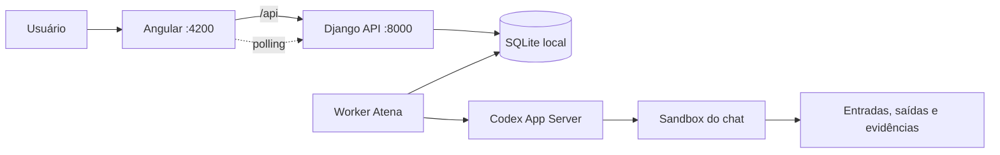
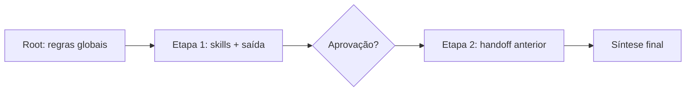
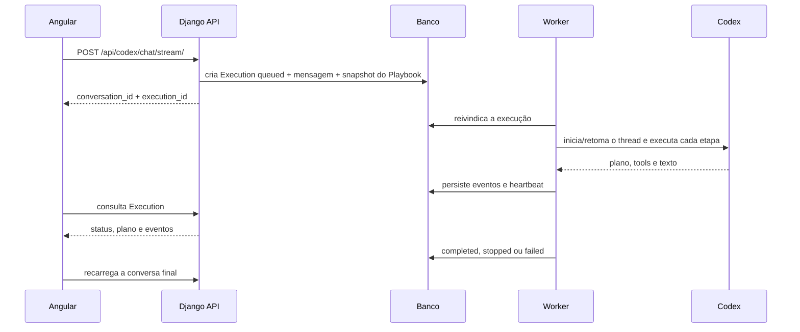

# Arquitetura atual da Atena

Este documento descreve o sistema que está em execução hoje. O frontend é
exclusivamente Angular; Django é uma API com um worker de agente separado.

## Visão geral



## Componentes

### Angular

`frontend/` é a única interface do usuário. Possui chat, histórico,
configurações, playbooks, arquivos, planos ao vivo, perguntas interativas e
aprovações. Em desenvolvimento, seu proxy encaminha apenas `/api` ao Django.

### Django API

`auditor_project/` configura o Django e `auditor/` contém modelos e endpoints.
O Django:

- persiste conversas, mensagens, execuções e interações;
- recebe uploads e publica downloads/artefatos;
- cadastra agentes, skills, conhecimentos e playbooks;
- aceita pedidos de pausa, resposta e aprovação;
- expõe o Django Admin em `/admin/`.

O template engine e `django.contrib.staticfiles` permanecem exclusivamente por
compatibilidade com o Admin. Não existem templates da aplicação no Django.

### Worker persistente

`python manage.py run_agent_worker` reivindica execuções `queued` no banco e
processa uma por vez no modo local. O lock `runtime/agent-worker.lock` impede dois
workers locais simultâneos sobre SQLite.

O request HTTP termina depois de enfileirar. Por isso, fechar o navegador ou
reiniciar apenas a API não encerra o turno em execução.

### Codex App Server

`auditor/codex_app_server.py` abre ou retoma a thread do agente, publica planos,
atividades e solicitações de aprovação. Cada conversa trabalha em um diretório
isolado e utiliza as skills de `.agents/skills/`.

O motor anterior em `auditor/ai_service.py` e `tools/` permanece como backend de
compatibilidade para os endpoints legados de agente; ele não renderiza frontend.

## Playbooks executáveis

Playbook não é apenas um prompt nem uma decoração do chat. Ele é o contrato de
execução do worker Atena/Codex:

- o nó `root` define as regras globais do orquestrador;
- os demais nós são etapas com objetivo, instruções e saída esperada;
- as arestas representam dependências e formam um DAG validado sem ciclos;
- skills do root são herdadas pelas etapas e skills da etapa especializam o
  trabalho;
- cada etapa pode exigir aprovação, permitir ou impedir perguntas, repetir em
  falha e escolher entre interromper ou continuar;
- a política global controla confirmação por etapa, interrupção em falha e
  síntese final.

Ao enfileirar um turno, a API guarda `_playbook_snapshot` dentro de
`Execution.request_payload`. Esse snapshot contém nome, versão, grafo, skills e
políticas. O worker percorre a ordem topológica no mesmo thread Codex e persiste
o plano (`inProgress`, `completed` ou `failed`) depois de cada etapa. Os handoffs
das etapas entram no contexto da próxima; ao final, o orquestrador consolida a
resposta quando a síntese está habilitada.

Cada salvamento cria `PlaybookRevision`. Restaurar uma versão cria outra versão
em vez de sobrescrever o histórico. Assim, a versão mostrada no chat é
rastreável e uma edição durante a execução não muda o trabalho em andamento.



## Ciclo durável de uma execução



Estados ativos: `queued`, `starting`, `running`, `waiting_user` e `stopping`.
Estados terminais: `completed`, `stopped` e `failed`.

## Human-in-the-loop

Perguntas, comandos e permissões ficam em `ExecutionInteraction`, com token,
payload, resposta, expiração e status. Como a interação está no banco, Angular
e worker podem estar em processos diferentes. O botão de parar grava `stopping`;
um observador do worker traduz esse estado para `turn/interrupt` no Codex.

## Organização por conversa

Os dados locais ficam sob `runtime/codex_sessions/<conversation_id>/`:

```text
entrada/       uploads e datasets recebidos
trabalho/      área gravável do sandbox
saida/         artefatos entregues ao usuário
evidencias/    rastreabilidade de execuções
versoes/       versões anteriores de artefatos
manifesto_sessao.json
```

O manifesto é um índice; não substitui os arquivos. Entradas não devem ser
alteradas pelo agente e saídas devem ser materializadas antes da resposta final.

## Persistência atual e destino ECS

| Responsabilidade | Local atual | Produção planejada |
|---|---|---|
| Conversas e fila | SQLite | PostgreSQL/RDS |
| Worker | management command | ECS Service/Task |
| Artefatos | filesystem local | S3 |
| Fila distribuída | tabela `Execution` | SQS + estado no PostgreSQL |
| Segredos | `.env` local ignorado | Secrets Manager |
| Frontend | Angular dev server | build estático/CDN |

As interfaces persistentes (`Execution`, eventos e interações) foram mantidas
independentes do transporte para permitir essa troca sem reescrever o Angular.

## Estrutura relevante

```text
frontend/                    interface Angular
auditor/                     API, modelos e integração com o agente
auditor/management/commands/ worker local
auditor_project/             configuração Django
.agents/skills/              skills da Atena
tools/                       ferramentas do motor compatível
runtime/codex_sessions/      dados locais por conversa (ignorado no Git)
documentacao/                operação e arquitetura atuais
```

Não existem `chat/`, `layout/`, `static/js` ou templates de frontend Django na
arquitetura atual.
