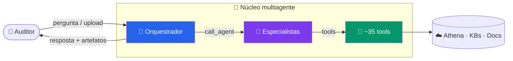
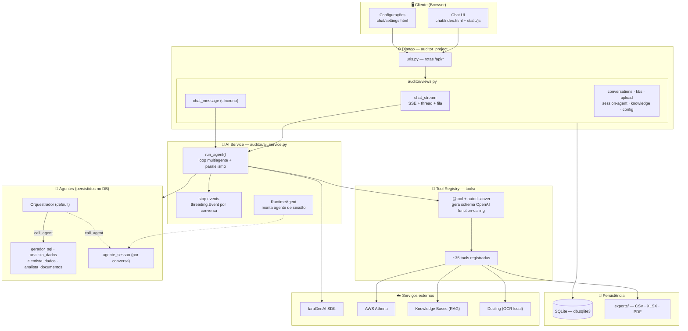
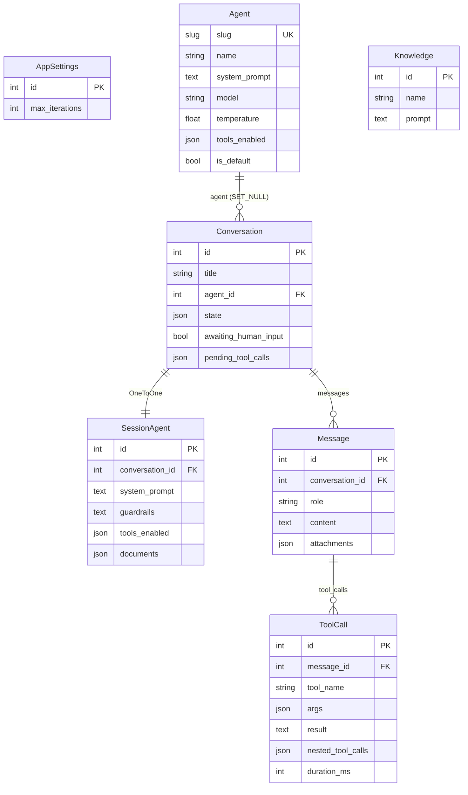
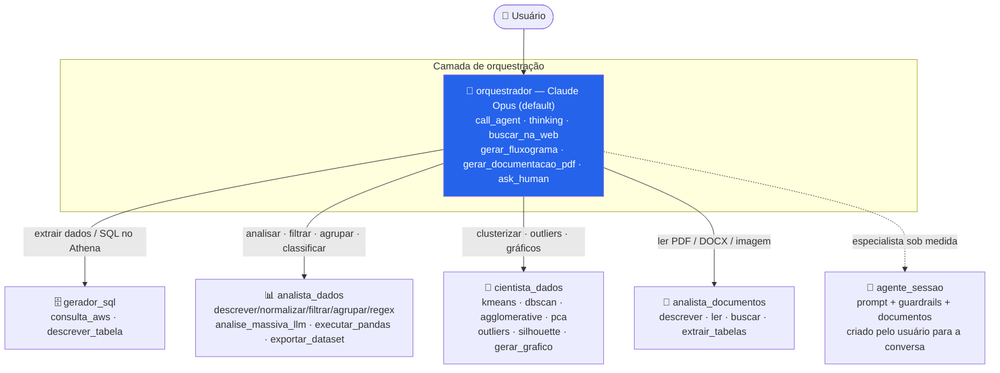
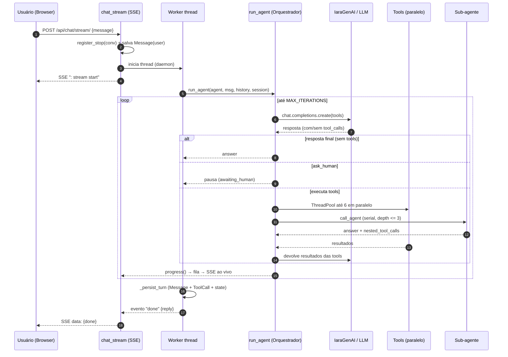
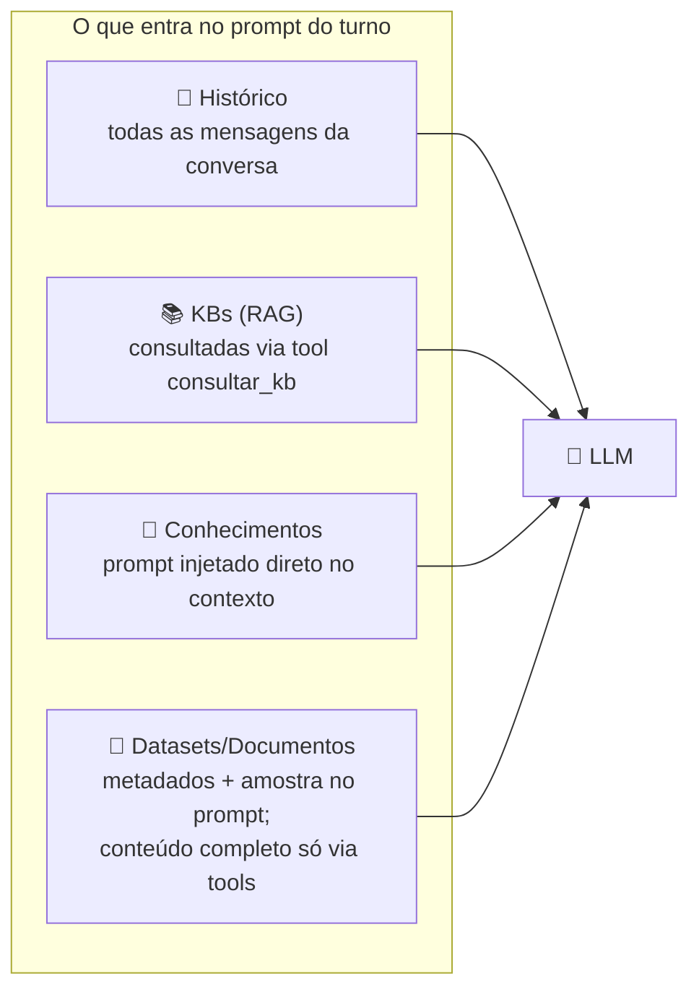

<div align="center">

# 🏛️ Arquitetura Completa — Auditor Multi-Agentes

**Plataforma Django de auditoria técnica assistida por IA.**
Um orquestrador multiagente delega tarefas a agentes especialistas, que executam
um loop de _function-calling_ sobre um catálogo de ~35 _tools_ — com execução
paralela, streaming ao vivo (SSE), _human-in-the-loop_ e RAG sobre bases de
conhecimento.

`Django 6` · `IaraGenAI (Bedrock/Azure/Vertex)` · `AWS Athena` · `Docling OCR` · `scikit-learn` · `SSE`

</div>

---

## 📑 Índice

1. [Visão geral](#1-visão-geral)
2. [Stack tecnológico](#2-stack-tecnológico)
3. [Arquitetura em camadas](#3-arquitetura-em-camadas)
4. [Modelo de dados](#4-modelo-de-dados)
5. [Hierarquia de agentes e roteamento](#5-hierarquia-de-agentes-e-roteamento)
6. [Catálogo de tools](#6-catálogo-de-tools)
7. [O motor: ciclo de um turno](#7-o-motor-ciclo-de-um-turno)
8. [Estado de sessão](#8-estado-de-sessão)
9. [Providers e modelos](#9-providers-e-modelos)
10. [Memória, RAG e conhecimentos](#10-memória-rag-e-conhecimentos)
11. [Ingestão de arquivos](#11-ingestão-de-arquivos)
12. [API HTTP](#12-api-http)
13. [Estrutura de diretórios](#13-estrutura-de-diretórios)
14. [Recursos transversais](#14-recursos-transversais)

---

## 1. Visão geral



> **Fonte da verdade da configuração dos agentes:** o banco `db.sqlite3` (tabela
> `auditor_agent`). Os prompts em `prompts/*.md` são recarregados nas migrations.

---

## 2. Stack tecnológico

| Camada | Tecnologia |
|---|---|
| **Backend** | Django 6.0 (`auditor_project`) |
| **App principal** | `auditor` (models, views, `ai_service`) |
| **Persistência** | SQLite (`db.sqlite3`) |
| **LLM Gateway** | **IaraGenAI SDK** (`iaragenai`) — multi-provider |
| **Providers** | Bedrock (Claude), Azure OpenAI (GPT), Vertex (Gemini) |
| **Dados corporativos** | AWS **Athena** (base FQ de reclamações) via `awswrangler`/`boto3` |
| **RAG** | Knowledge Bases IARA (`similarity_search`) |
| **OCR de documentos** | **Docling** (modelos locais offline em `arquivos_suporte/docling/`) |
| **Data / ML** | pandas, scikit-learn (KMeans, DBSCAN, PCA, IsolationForest…) |
| **Streaming** | Server-Sent Events (SSE) + threads + `queue.Queue` |
| **Frontend** | HTML + JS estático (`chat/`, `static/js`, `static/css`) |

---

## 3. Arquitetura em camadas



**Fluxo em 3 níveis:** o Browser fala com as **views** (HTTP/SSE) → que invocam o
**motor** (`run_agent`) → que consome o **registry** de tools e delega a
**sub-agentes**. Tudo persiste em SQLite; artefatos vão para `exports/`.

---

## 4. Modelo de dados

Apenas **7 modelos** Django. As Knowledge Bases **não** são persistidas — vêm da
IARA em runtime e são referenciadas em `Conversation.state["active_kbs"]`.



| Modelo | Papel |
|---|---|
| `AppSettings` | Singleton (`pk=1`) — `max_iterations` global do loop (1–100). |
| `Agent` | Agente democratizado: prompt, modelo, `tools_enabled`, `is_default`. |
| `Conversation` | Conversa + `state` (sessão compartilhada entre tools) + flags de pausa. |
| `SessionAgent` | Especialista criado **só** para uma conversa (`slug=agente_sessao`). |
| `Knowledge` | Prompt de especialista/processo cadastrado na tela e injetável na conversa. |
| `Message` | Mensagem (`user`/`assistant`) + anexos e cards de artefato. |
| `ToolCall` | Registro de cada tool: args, resultado, erro, duração e sub-chamadas aninhadas. |

---

## 5. Hierarquia de agentes e roteamento



### Configuração efetiva (do `db.sqlite3`)

| Agente | Modelo | Temp | Default | Nº tools |
|---|---|:--:|:--:|:--:|
| **orquestrador** | `anthropic.claude-opus-4-6-v1` | 0.0 | ✅ | 6 |
| **gerador_sql** | `anthropic.claude-opus-4-6-v1` | 0.2 | — | 6 |
| **analista_dados** | `anthropic.claude-opus-4-6-v1` | 0.4 | — | 19 |
| **cientista_dados** | `anthropic.claude-opus-4-6-v1` | 0.3 | — | 18 |
| **analista_documentos** | `anthropic.claude-opus-4-6-v1` | 0.3 | — | 8 |
| **agente_sessao** | definido pelo usuário | — | — | variável |

> ⚠️ **Nota:** para modelos Claude, o motor força `temperature=1.0` (thinking
> ativo) — a temperatura configurada na tabela **não tem efeito** hoje. Ver
> `melhorias/opniao_claude.md`, Tier 3.1.

**Regras de delegação:**
- `call_agent(agent_slug, task)` — sub-agentes rodam **serialmente**
  (compartilham a sessão), profundidade máxima **3** (`MAX_DEPTH`).
- **Auto-tools do orquestrador:** ele mesmo faz `gerar_fluxograma`,
  `gerar_documentacao_pdf` e `buscar_na_web` (não delega).
- **Agente de sessão:** injetado em runtime no orquestrador via
  `_session_specialist_injection`, sem tocar no prompt democratizado.

---

## 6. Catálogo de tools

Registradas via `@tool` + `autodiscover()`. O decorator infere o schema JSON
(OpenAI function-calling) a partir das _type hints_ e do docstring (`Args:`).
Tools com parâmetro `_session: dict` acessam o estado compartilhado da conversa.

| Domínio | Tools |
|---|---|
| 🧠 **Meta / fluxo** | `thinking` · `call_agent` · `ask_human` _(human-in-loop)_ |
| 🗄️ **Extração SQL (Athena)** | `descrever_tabela` · `consulta_aws` |
| 📊 **Análise (pandas)** | `descrever_dataset` · `normalizar_coluna` · `filtrar_por_termo` · `contar_keywords` · `contem_termo` · `agrupar` · `regex_extrair` · `executar_pandas` |
| 🚀 **IA em massa** | `analise_massiva_llm` _(classifica N linhas em paralelo)_ |
| 🔬 **Ciência de dados / ML** | `executar_kmeans` · `executar_dbscan` · `executar_agglomerative` · `calcular_silhouette` · `comparar_clusters` · `avaliar_clusters` · `executar_pca` · `detectar_outliers` · `selecionar_features` |
| 📄 **Documentos (OCR/RAG)** | `descrever_documento` · `ler_documento` · `buscar_no_documento` · `extrair_tabelas_do_documento` · `consultar_kb` |
| 🎨 **Artefatos** | `gerar_grafico` · `gerar_fluxograma` · `gerar_documentacao_pdf` · `exportar_dataset` |
| 🌐 **Web** | `buscar_na_web` _(grounded)_ |

> **Como criar uma tool:** basta um arquivo `.py` em `tools/` com o decorator
> `@tool` — o autodiscovery registra sozinho. Ver `COMO_SUBIR_UMA_TOOL.txt`.

Cards de artefato (export, chart, mermaid, table) são publicados via
`publish_attachment()` e aparecem automaticamente no chat.

---

## 7. O motor: ciclo de um turno



**Regras do loop (`run_agent`):**

- **Paralelismo:** todas as tool calls do mesmo turno rodam juntas (até
  `MAX_PARALLEL_TOOLS = 6`); `call_agent` roda **serial** (compartilha estado).
- **Human-in-the-loop:** a 1ª `ask_human` **pausa** o turno antes de executar
  qualquer outra tool; a conversa fica `awaiting_human_input=True`.
- **Stop:** `threading.Event` por conversa; o loop (e sub-agentes) checa a cada
  iteração e encerra preservando resultados parciais.
- **Orçamento esgotado:** ao bater `MAX_ITERATIONS` (default 18), faz uma última
  chamada com `tool_choice="none"`, forçando a síntese final a partir do que já
  foi apurado (em vez de descartar tudo).

---

## 8. Estado de sessão

`Conversation.state` é um dicionário mutável compartilhado entre tools e
sub-agentes durante o turno.

**Dados persistidos:**

| Chave | Conteúdo |
|---|---|
| `athena_last_result` | Dataset corrente — lista de dicts JSON-safe |
| `athena_last_columns` | Colunas do dataset corrente |
| `athena_last_source` | Origem: `{kind: upload\|batch_docs\|athena, ...}` |
| `named_datasets` | `{nome: [registros]}` — datasets anteriores preservados |
| `documento_atual` | `{filename, markdown, char_count, page_count}` |
| `active_kbs` | KBs RAG selecionadas: `[{id, name, description}]` (máx. 10) |
| `active_knowledge` | Ids dos conhecimentos ativos (conteúdo lido do banco em runtime) |

**Controle interno (prefixo `__`, removido antes de persistir):**
`__conversation_id`, `__history`, `__progress` (callback SSE), `__stop_event`,
`__agent_call_depth`, `__awaiting_human`, `__human_question`,
`__nested_tool_calls`, `__pending_attachments`, `__active_knowledge`.

---

## 9. Providers e modelos

O provider é **derivado do id do modelo** em `_provider_for()` — não exige mexer
no `.env` ao trocar de modelo na tela.

| Provider | Prefixo do modelo | Modelos disponíveis |
|---|---|---|
| **bedrock** | `anthropic.` / `claude` (e `amazon`,`meta`,`mistral`,`qwen`,`deepseek`) | Claude Opus 4.6/4.8, Sonnet 4.5/4 |
| **azure_openai** | `gpt` / `o1` / `o3` / `o4` / `openai.` | gpt-5.2, 5.1, 5, 5-mini, 4.1, 4.1-mini, 4o |
| **vertex** | `gemini` / `vertex` | gemini-2.5-pro, 2.5-flash, 2.5-flash-lite |

- **Claude (Bedrock):** `thinking=adaptive`, `effort=high`, `max_tokens=64000`,
  `temperature=1.0`.
- **Demais:** usam a `temperature` do próprio agente.
- Config via `.env`: `IARA_PROVIDER`, `IARA_MODEL_DEFAULT`,
  `IARA_MODEL_ORQUESTRADOR`, `IARA_CLIENT_ID`, `IARA_CLIENT_SECRET`,
  `IARA_ENVIRONMENT`.

---

## 10. Memória, RAG e conhecimentos

O sistema tem **três** mecanismos distintos de "memória/contexto":



| Mecanismo | Como entra | Observação |
|---|---|---|
| **Histórico** | todas as mensagens `role`+`content` | ⚠️ sem janela/sumarização — cresce linearmente (ver melhorias, Tier 2.1) |
| **KBs (RAG)** | `consultar_kb` → `similarity_search` (cosine, top-k) | catálogo injetado no contexto; trechos numerados p/ citação `[n]` |
| **Conhecimentos** | conteúdo colado **direto** no system context | prompt de especialista/processo cadastrado na tela |
| **Datasets/Docs** | só metadados + amostra vão ao LLM | o conteúdo pesado fica na sessão e é acessado por tools |

> **Importante:** os resultados de `ToolCall` de turnos passados **não** voltam ao
> modelo — só `role`+`content`. É um trade-off para conter o contexto (ver
> melhorias, Tier 2.3).

---

## 11. Ingestão de arquivos

| Tipo | Extensões | Pipeline | Vira |
|---|---|---|---|
| **Tabela** | `.csv .xlsx .xls` | pandas (`_read_table`) | dataset corrente (`athena_last_*`) |
| **Documento** | `.pdf .docx .pptx .html .md .txt .png .jpg .tiff …` | **Docling** + OCR (RapidOCR ONNX, offline) | `documento_atual` |
| **Lote** | `.pdf .txt` | PyMuPDF (`fitz`) / texto | dataset `[nome_arquivo, conteudo_extraido]` |
| **Doc do agente** | `.pdf .txt .md .docx .doc` | Docling / texto puro | `SessionAgent.documents` (injetado no prompt) |

**Limites:** 25 MB por arquivo · 50.000 linhas processadas · 3 linhas para o LLM ·
100 linhas na UI · 200 arquivos por upload em lote.

---

## 12. API HTTP

| Método | Rota | View |
|---|---|---|
| GET | `/` · `/manual/` · `/settings/` | páginas |
| POST | `/api/chat/` | `chat_message` (síncrono) |
| POST | `/api/chat/stream/` | `chat_stream` (SSE) |
| POST | `/api/conversations/<id>/stop/` | `chat_stop` |
| GET | `/api/conversations/` · `/<id>/` | lista / detalhe |
| POST | `/api/conversations/<id>/rename/` · `DELETE .../delete/` | rename / delete |
| GET | `/api/conversations/<id>/dataset/` | pagina o dataset corrente (sem LLM) |
| GET | `/api/kbs/?refresh=1` | lista KBs IARA (cache 5 min) |
| GET/POST | `/api/conversations/<id>/kbs/[save/]` | KBs ativas da conversa |
| GET/POST | `/api/knowledge/` · `/<id>/` (+ create/update/delete) | conhecimentos |
| GET/POST | `/api/conversations/<id>/knowledge/[save/]` | conhecimentos ativos |
| GET/POST/DELETE | `/api/conversations/<id>/session-agent/[save/\|delete/]` | agente de sessão |
| POST | `/api/session-agent/create-conversation/` · `/extract-document/` | criar / OCR |
| POST | `/api/upload/` · `/api/upload-batch/` | upload de tabelas / docs |
| GET | `/api/exports/<filename>` | download de artefato (regex anti path-traversal) |
| GET/POST | `/api/config/` · `/config/settings/` · `/config/agents/<slug>/` | configuração |

---

## 13. Estrutura de diretórios

```
auditor_project/      Config Django (settings, urls, wsgi/asgi)
auditor/              App principal
 ├─ models.py         7 modelos (Agent, Conversation, SessionAgent, Message, ToolCall, AppSettings, Knowledge)
 ├─ ai_service.py     Motor multiagente (run_agent, stop, RuntimeAgent, providers)
 ├─ views.py          API REST + streaming SSE
 ├─ urls.py           Rotas
 ├─ proxy_config.py   Proxy corporativo (HuggingFace/Docling)
 └─ migrations/       Configuração democratizada dos agentes (fonte no DB)
tools/                Catálogo de ~35 tools + registry (@tool, autodiscover)
prompts/              System prompts (.md) dos agentes
chat/                 Frontend (index.html, settings.html)
static/               CSS/JS
scripts/              Utilitários (setup Docling, listar modelos IARA)
arquivos_suporte/     Modelos locais do Docling (OCR) + CA bundle
exports/              Artefatos gerados (CSV/XLSX/PDF)
documentacao/         📖 Esta documentação
melhorias/            🛠️ Oportunidades de melhoria (opniao_claude.md)
db.sqlite3            Banco (agentes, conversas, mensagens, tool calls)
```

> **Nota:** o diretório `layout/` é um esqueleto Django alternativo **não ativo**
> — candidato a remoção (ver `melhorias/opniao_claude.md`, Tier 4.3).

---

## 14. Recursos transversais

- **Streaming ao vivo (SSE):** worker em thread separada publica eventos de
  progresso numa `queue.Queue`; heartbeat `: keep-alive` mantém a conexão atrás
  de proxies; `X-Accel-Buffering: no` desliga o buffering do nginx.
- **RAG:** `consultar_kb` faz `similarity_search` (cosine, top-k) nas KBs ativas;
  trechos numerados para citação `[n]`. O catálogo de KBs é injetado no contexto.
- **OCR:** upload de PDF/DOCX/imagem é extraído para markdown via **Docling**
  (modelos locais, offline) e fica em sessão para o `analista_documentos`.
- **Agente de sessão:** o prompt do usuário é combinado por trás com boas práticas
  de auditoria + guardrails + documentos anexados
  (`build_runtime_agent_from_session`).
- **Rastreabilidade:** cada `ToolCall` grava args, resultado, erro, duração e
  `nested_tool_calls` (a árvore de delegação renderizada no frontend).

---

<div align="center">

**Documentação relacionada:**
[Como rodar](COMO_RODAR.md) ·
[Oportunidades de melhoria](../melhorias/opniao_claude.md) ·
[Como subir uma tool](../COMO_SUBIR_UMA_TOOL.txt)

</div>
