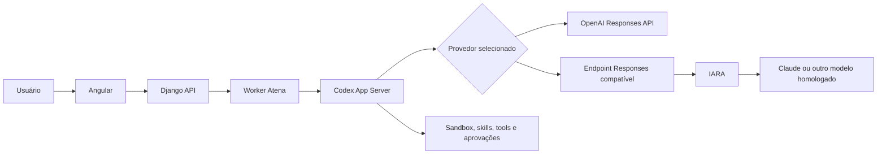

# Guia para implementar IARA no Atena/Codex

Este documento é um **contrato de implementação para agentes de IA**. Use-o
quando for solicitado adicionar o IARA como provedor de modelos do Atena,
inclusive para executar o runtime com modelos Claude disponíveis no IARA.

> Objetivo: permitir escolher **OpenAI** ou **IARA** sem trocar o motor do
> Atena, sem perder sandbox, skills, tools, playbooks, perguntas, aprovações,
> arquivos, memória, planos ao vivo ou execução persistente.

## Pedido pronto para entregar a outro agente

Copie e envie o texto abaixo junto com este repositório:

```text
Implemente a integração IARA no Atena seguindo integralmente o arquivo
readm_implementar_iara.md. Antes de editar, inspecione o estado atual do
repositório e a documentação/SDK oficial interno do IARA disponível no
ambiente. Não adivinhe endpoints, nomes de modelos ou formatos de eventos.

Preserve OpenAI como opção funcional e preserve toda a arquitetura atual do
Atena/Codex. Faça a integração por uma camada de provedor. Se o IARA não for
compatível com a OpenAI Responses API, implemente um adaptador compatível em
vez de substituir o runtime agente. Nunca grave credenciais no código, Git,
banco, logs ou frontend.

Implemente, teste e documente. Não considere concluído enquanto os testes de
contrato, os testes OpenAI de regressão e os testes IARA com tools e streaming
não passarem. Ao final, apresente arquivos alterados, evidências dos testes,
limitações conhecidas e instruções de rollback.
```

## 1. Vocabulário e decisão arquitetural

- **Atena** é a aplicação: Angular, Django, worker, banco, conversas, arquivos,
  playbooks e experiência do usuário.
- **Codex** é o runtime agente incorporado: coordena execução, sandbox, skills,
  tools, planos, perguntas, permissões e artefatos.
- **OpenAI** e **IARA** são provedores de LLM. Eles não substituem o Atena.
- **Claude** é um modelo que poderá ser acessado por meio do IARA, caso esteja
  liberado no ambiente e cumpra o contrato técnico necessário.

A troca do provedor deve ocorrer nesta única fronteira:



Não criar dois motores de chat. Não reimplementar playbooks, sandbox ou tools
dentro do SDK do IARA.

## 2. Estado comprovado do repositório antes da integração

No momento em que este guia foi criado:

- o caminho principal está em `auditor/codex_app_server.py`;
- o runtime portátil vem de `openai-codex==0.147.0` em `requirements.txt`;
- o runtime utiliza o `CODEX_HOME` próprio em `runtime/codex_home/`;
- autenticação do caminho principal aceita `OPENAI_API_KEY` e o fallback legado
  `OPENAI_ADMIN_KEY`;
- modelo e esforço são lidos de `ATENA_CODEX_MODEL` e
  `ATENA_CODEX_REASONING_EFFORT`;
- o motor IARA antigo ainda existe em `auditor/ai_service.py` e algumas tools,
  mas não é o provedor atual do Codex;
- há referências legadas ao SDK em `scripts/list_iara_models.py`,
  `auditor/views.py`, `tools/analise_massiva.py` e integrações de Knowledge
  Base. Elas não devem ser apagadas nem confundidas com a nova integração;
- a dependência do SDK IARA está comentada em `requirements.txt`. Não a habilite
  sem confirmar o pacote e a versão aprovados no ambiente corporativo.

Antes de implementar, confirme novamente esses fatos. O repositório pode ter
evoluído depois da criação deste documento.

## 3. Bloqueio técnico que deve ser validado primeiro

O provedor customizado do Codex aceita atualmente o protocolo `responses`.
Assim, o agente deve descobrir qual dos cenários abaixo corresponde ao IARA:

### Cenário A — IARA já expõe OpenAI Responses API compatível

Configurar o IARA diretamente como `model_provider` do Codex. Ainda é
obrigatório testar streaming, tools e autenticação.

### Cenário B — IARA expõe Chat Completions, Anthropic Messages ou SDK próprio

Criar um adaptador HTTP interno:

```text
Codex Responses API
        ↓
adaptador Atena/IARA
        ↓
SDK ou API oficial do IARA
        ↓
Claude
```

O adaptador recebe e devolve o contrato da Responses API e traduz chamadas e
eventos para o formato real do IARA. Uma chamada simples que retorna texto **não
é suficiente** para declarar compatibilidade.

### Matriz obrigatória de descoberta

O agente deve preencher esta tabela com evidências da documentação interna ou
de testes controlados antes de escolher a implementação:

| Capacidade | Endpoint/formato IARA | Compatível diretamente? | Evidência |
|---|---|---:|---|
| Criação de resposta | A confirmar | A confirmar | Link/trecho/teste |
| Streaming SSE | A confirmar | A confirmar | Link/trecho/teste |
| Tool calls | A confirmar | A confirmar | Link/trecho/teste |
| Retorno da tool ao modelo | A confirmar | A confirmar | Link/trecho/teste |
| Instrução `developer/system` | A confirmar | A confirmar | Link/trecho/teste |
| Cancelamento | A confirmar | A confirmar | Link/trecho/teste |
| Renovação do token | A confirmar | A confirmar | Link/trecho/teste |
| Erros e rate limit | A confirmar | A confirmar | Link/trecho/teste |
| Context window do modelo | A confirmar | A confirmar | Link/trecho/teste |

Se a documentação do IARA não estiver disponível, pare a integração externa e
solicite **documentação técnica**, nunca credenciais em chat ou commit.

## 4. Contrato funcional do provedor

A camada de provedor deve fornecer, no mínimo:

- identificador estável: `openai` ou `iara`;
- modelo escolhido, separado do nome do provedor;
- disponibilidade baseada em configuração válida;
- autenticação e renovação de token;
- URL de inferência;
- timeouts e retentativas limitadas;
- suporte declarado a streaming e tools;
- mensagem de erro segura para a interface;
- metadados de auditoria sem tokens ou conteúdo sensível.

O Claude não deve ser fixado no código. O ID exato deve vir do catálogo ou da
configuração homologada do IARA.

## 5. Seleção na interface e persistência

Adicionar no Angular um seletor simples de provedor, por exemplo:

```text
[ OpenAI ] [ IARA ]       Modelo: [ Claude homologado ▼ ]
```

Regras:

1. Mostrar apenas provedores configurados e saudáveis.
2. OpenAI continua sendo o padrão enquanto o IARA não estiver homologado.
3. A escolha pertence à conversa/execução; não deve ser uma variável global do
   servidor que muda todos os usuários simultaneamente.
4. Ao enfileirar, congelar `provider` e `model` em
   `Execution.request_payload`, assim como já ocorre com o snapshot do playbook.
5. O worker usa o snapshot da execução, não a seleção atual da tela.
6. Trocar de provedor não pode tentar retomar cegamente um thread criado em
   outro provedor. Manter threads por provedor ou iniciar um novo thread e
   recompor o histórico persistido da conversa.
7. Mostrar na execução qual provedor e modelo foram usados, sem mostrar
   credenciais.

Essa regra evita que uma execução longa comece em OpenAI e termine em IARA após
outro usuário alterar uma configuração.

## 6. Configuração do Codex

A documentação oficial do Codex permite declarar provedores personalizados com
`model_provider` e `model_providers.<id>`. O único `wire_api` suportado é
`responses`.

Configuração ilustrativa — os valores são placeholders, não uma configuração
confirmada do IARA:

```toml
model_provider = "iara"
model = "ID_DO_MODELO_HOMOLOGADO"

[model_providers.iara]
name = "IARA"
base_url = "URL_RESPONSES_COMPATIVEL"
wire_api = "responses"
env_key = "IARA_CODEX_TOKEN"
request_max_retries = 2
stream_max_retries = 2
stream_idle_timeout_ms = 300000
```

Se o token precisar ser renovado por comando, usar a autenticação dinâmica
suportada pelo Codex em vez de gravar um token estático:

```toml
[model_providers.iara.auth]
command = "CAMINHO_DO_PYTHON_DA_VENV"
args = ["CAMINHO_DO_SCRIPT_DE_TOKEN"]
timeout_ms = 10000
refresh_interval_ms = 240000
```

O comando deve imprimir **somente o token** em `stdout`. Erros vão para
`stderr`, sempre sem `client_secret` ou token.

As configurações de provedor não podem depender do `.codex/config.toml` local
do projeto. Elas devem ser criadas no `CODEX_HOME` controlado pelo Atena,
atualmente `runtime/codex_home/`, que já está ignorado pelo Git. Não alterar
configuração compartilhada durante uma execução: use perfis ou diretórios
separados por provedor e verifique a compatibilidade exata com a versão do
runtime fixada em `requirements.txt`.

Referência: [Configuração oficial do Codex](https://developers.openai.com/codex/config-reference/).

## 7. Variáveis de ambiente

O `.env.example` deve conter somente nomes e exemplos falsos. A forma final
dependerá da documentação do IARA, mas a separação conceitual deve ser:

```ini
# Provedor OpenAI
OPENAI_API_KEY=preencha_localmente
ATENA_OPENAI_MODEL=modelo_homologado

# Habilitação do provedor IARA
ATENA_IARA_ENABLED=false
ATENA_IARA_MODEL=id_exato_do_modelo
ATENA_IARA_RESPONSES_BASE_URL=url_ou_adaptador

# Autenticação IARA — confirmar nomes na documentação interna
IARA_CLIENT_ID=preencha_localmente
IARA_CLIENT_SECRET=preencha_localmente
IARA_ENVIRONMENT=homol
```

Não criar `IARA_ACCESS_TOKEN` persistente se o token for temporário e houver
fluxo oficial de renovação.

## 8. Pontos esperados de alteração

O agente deve confirmar os locais reais, mas provavelmente trabalhará em:

- `auditor/codex_app_server.py`: configuração e autenticação por provedor;
- `auditor/codex_views.py`: snapshot do provedor, threads e eventos;
- `auditor/models.py`: apenas se o JSON existente não for suficiente;
- `auditor/tests.py`: regressão e contrato do provedor;
- `frontend/src/app/pages/chat/`: seletor e estado visual;
- `frontend/src/app/api/`: payloads, status e modelos;
- `.env.example`: placeholders seguros;
- `README.md` e `documentacao/`: operação local e produção;
- novo adaptador Responses/IARA, somente se a matriz de compatibilidade exigir.

Evitar modificar `auditor/ai_service.py` para transformar o motor legado no
motor principal. Ele pode servir como evidência sobre o SDK, mas o novo caminho
deve continuar passando pelo Codex App Server.

## 9. Segurança obrigatória

- Nunca versionar `.env`, tokens, client secrets, certificados ou credenciais
  AWS.
- Nunca enviar segredo para o Angular.
- Nunca salvar segredo em `Conversation.state`, `Execution.request_payload`,
  mensagens, eventos ou logs.
- Redigir erros antes de persistir ou mostrar na interface.
- Usar HTTPS e CA corporativa conforme o ambiente.
- Aplicar menor privilégio e separar homologação de produção.
- Limitar retentativas; erro de autenticação não pode deixar a interface em
  “Atena está preparando a execução” indefinidamente.
- Manter o adaptador inacessível publicamente ou exigir autenticação interna.
- Preservar as restrições somente leitura das operações AWS/Athena.

## 10. Tratamento de erros

Todo erro precisa levar a execução a um estado terminal ou recuperável:

| Falha | Comportamento esperado |
|---|---|
| Provedor sem credenciais | falhar antes do turno com orientação segura |
| Modelo inexistente | falhar informando provedor/modelo sem expor token |
| Token expirado | renovar uma vez pelo fluxo oficial; depois falhar |
| Timeout de conexão | encerrar com erro e permitir tentar novamente |
| Stream interrompido | retentar dentro do limite sem duplicar tools |
| Rate limit | respeitar espera quando informada e limitar tentativas |
| Adaptador indisponível | marcar execução como `failed` |
| Usuário cancela | propagar cancelamento até Codex, adaptador e IARA |

Não fazer fallback silencioso de IARA para OpenAI. O usuário deve saber qual
provedor processou a execução.

## 11. Testes obrigatórios

### Testes unitários e de contrato

- leitura da configuração OpenAI e IARA;
- provedor desabilitado ou sem credenciais;
- geração segura do perfil/config do Codex;
- autenticação/renovação sem vazamento em logs;
- seleção persistida no payload da execução;
- duas execuções simultâneas com provedores diferentes;
- thread separado ao trocar de provedor;
- tradução de instruções e entradas;
- resposta textual completa;
- streaming de deltas na ordem correta;
- chamada de tool, retorno da tool e continuação do modelo;
- erros, timeout, rate limit e stream interrompido;
- cancelamento real;
- sanitização de segredos.

### Teste ponta a ponta com cada provedor

1. Enviar uma saudação.
2. Pedir um plano com pelo menos três etapas e conferir o avanço.
3. Pedir uma pergunta interativa ao usuário.
4. Executar um comando que exija aprovação.
5. Criar um arquivo TXT no sandbox e publicá-lo como artefato.
6. Subir um CSV pequeno, analisá-lo e gerar XLSX ou HTML.
7. Fechar o navegador durante uma execução e confirmar que o worker continua.
8. Cancelar uma execução em andamento e confirmar o estado `stopped`.
9. Simular credencial inválida e indisponibilidade de rede.
10. Confirmar que a execução registra provedor e modelo corretos.

### Regressão mínima

```bash
source .venv/bin/activate
python manage.py test auditor

cd frontend
npm run build
```

Também testar novamente o fluxo OpenAI real. A integração IARA não pode quebrar
o provedor que já funciona.

## 12. Critérios de aceite

A tarefa só termina quando todos os itens forem verdadeiros:

- [ ] OpenAI e IARA são opções separadas e visíveis quando configuradas.
- [ ] A seleção não altera execuções de outros usuários.
- [ ] O provedor/modelo ficam congelados e auditáveis por execução.
- [ ] IARA com Claude responde por streaming.
- [ ] Plans, tools, perguntas, aprovações e cancelamento funcionam no IARA.
- [ ] Sandbox, skills, arquivos e playbooks continuam no Codex.
- [ ] Fechar a tela não interrompe o worker.
- [ ] Falhas deixam de exibir preparação infinita.
- [ ] Nenhum segredo aparece no Git, banco, logs ou frontend.
- [ ] Testes automatizados e ponta a ponta apresentam evidências.
- [ ] README operacional foi atualizado.
- [ ] Existe rollback simples para OpenAI somente.

## 13. O que não fazer

- Não trocar o nome Atena por IARA, Claude, OpenAI ou Codex.
- Não criar um segundo chat ou um segundo orquestrador.
- Não remover OpenAI para colocar IARA.
- Não assumir que `chat.completions.create()` é compatível com Responses.
- Não assumir que o Claude aceita parâmetros específicos dos modelos OpenAI.
- Não codificar endpoint, proxy, certificado, token ou modelo sem configuração.
- Não reutilizar `~/.codex`, ChatGPT Desktop ou caches pessoais da máquina.
- Não alterar `runtime/codex_home/config.toml` globalmente a cada clique quando
  houver possibilidade de execuções concorrentes.
- Não apagar análise massiva, Knowledge Base ou tools legadas.
- Não declarar sucesso com apenas um teste de “Olá”.

## 14. Rollback esperado

O rollback deve poder ser feito sem apagar conversas ou artefatos:

1. definir `ATENA_IARA_ENABLED=false`;
2. manter OpenAI como padrão;
3. impedir novas execuções IARA;
4. deixar execuções antigas e seus metadados consultáveis;
5. não remover migrations já aplicadas apenas para desfazer a interface.

Essa separação permite homologar o IARA gradualmente, mantendo o Atena
operacional durante todo o trabalho.

## 15. Decisão de implementação (resultado da integração)

**Cenário confirmado = A (passthrough Responses), não B.** O SDK `iaragenai`
expõe a **Responses API nativa** em `client.responses` (além de
`client.chat.completions`). O adaptador (`auditor/iara_adapter.py`) **repassa** o
corpo Responses do Codex para `client.responses` e devolve o SSE do IARA
**verbatim** — não traduz para Chat Completions.

Por que passthrough é obrigatório: o Codex 0.147 opera em "code mode" e envia a
ferramenta principal como `functions.exec` do tipo `custom` com
`format: {type: "grammar"}` (Lark), dentro de um item `additional_tools` no
`input`. Isso é nativo da Responses API e **não** tem representação em Chat
Completions. Verificado empiricamente: desligar `code_mode`/`code_mode_only`/
`code_mode_host` **não** remove a tool grammar. Logo, traduzir quebraria as
ferramentas do Codex; o passthrough as preserva.

**Requisito de rede (importante):** o SDK roteia `/responses` pelo gateway SSE
(`base_url_sse` = `agent-gateway.{env}.aws.cloud.ihf`), host distinto do gateway
padrão de chat.completions. Esse host precisa ser **alcançável** de onde o app
roda. Alguns ambientes de dev (ex.: SageMaker) resolvem o gateway dataplane
(chat.completions), mas **não** o `agent-gateway` de homol — nesses casos o
Codex↔IARA só funciona no ambiente de deploy (rede Itaú/ECS). Confirme com:

```
python -m testes.iara.check_iara_responses_reachable
```

Estado dos testes: `testes/iara/test_iara_adapter.py` (tradução pura) e
`testes/iara/test_iara_adapter_http.py` (passthrough HTTP/SSE com cliente falso)
passam offline. `testes/iara/e2e_codex_iara.py` (texto) e
`testes/iara/e2e_codex_iara_tools.py` (uso de ferramentas) provam o caminho
Codex→adaptador→IARA quando o `/responses` é alcançável.
